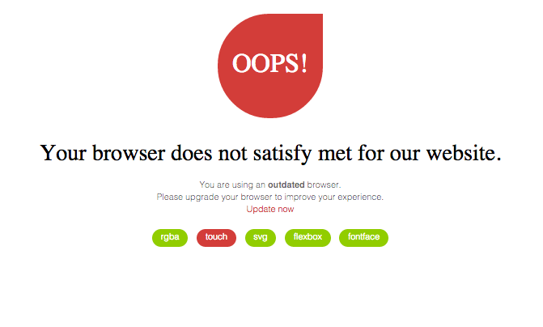

# Yoso Browsehappy

An angular js directive for detect browser capabilities and show warning on missed app requirements.    
If the browser missed required capabilities the user get a link to [outdatedbrowser](http://outdatedbrowser.com/) where he can update.    
The browser capabilities are detected using [Modernirz](http://modernizr.com/), which must be already implemented inside the project. 
All browser capabilities Modernitz detect can be used inside yoso browsehappy. To enable detetection add the required feature as parameter inside the directive tag.
 
 

### Install
```bash
$ npm install --save yoso-browsehappy
```

### Usage
Inject directive to your model:
```javascript
    angular.module('app.common.directives', [])
  .directive('yosoBrowsehappy', require('yoso-browsehappy'));
 ```

Insert into your template:
```html
    <yoso-browsehappy rgba svg touch></yoso-browsehappy>
 ```
Add required feature as parameter inside the directive tag to enable detection for it.
